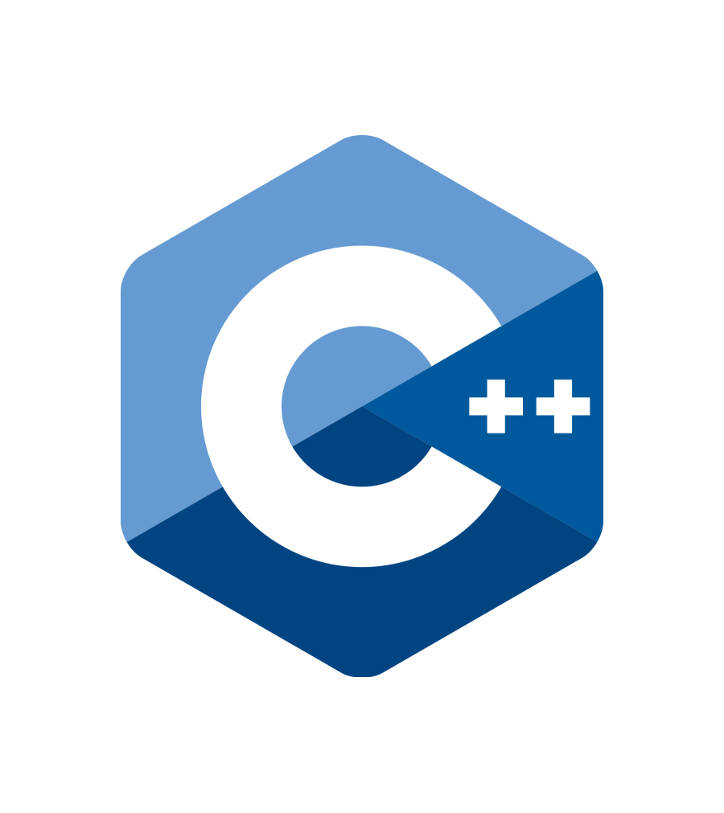

<!-- PROJECT SHIELDS -->
[![Contributors][contributors-shield]][contributors-url]
[![Forks][forks-shield]][forks-url]
[![Stargazers][stars-shield]][stars-url]
[![Issues][issues-shield]][issues-url]
[![MIT License][license-shield]][license-url]

<!-- PROJECT LOGO -->
 

  

  <h3 align="center">C++ For Everyone</h3>

  

    An awesome README template to jumpstart your projects!
     
    <a href="https://github.com/Hekkfern/Cpp-For-Everyone"><strong>Explore the docs »</strong></a>
     
     
    <a href="https://github.com/Hekkfern/Cpp-For-Everyone">View Demo</a>
    ·
    <a href="https://github.com/Hekkfern/Cpp-For-Everyone/issues">Report Bug</a>
    ·
    <a href="https://github.com/Hekkfern/Cpp-For-Everyone/issues">Request Feature</a>
  

<!-- TABLE OF CONTENTS -->

  
Table of Contents

  <ol>
    <li>
      <a href="#about-the-project">About The Project</a>
      <ul>
        <li><a href="#built-with">Built With</a></li>
      </ul>
    </li>
    <li>
      <a href="#getting-started">Getting Started</a>
      <ul>
        <li><a href="#prerequisites">Prerequisites</a></li>
        <li><a href="#installation">Installation</a></li>
      </ul>
    </li>
    <li><a href="#usage">Usage</a></li>
    <li><a href="#roadmap">Roadmap</a></li>
    <li><a href="#contributing">Contributing</a></li>
    <li><a href="#license">License</a></li>
    <li><a href="#contact">Contact</a></li>
    <li><a href="#acknowledgments">Acknowledgments</a></li>
  </ol>

## About The Project

[![Product Name Screen Shot][product-screenshot]](https://example.com)

(<a href="#readme-top">back to top</a>)

## Usage

Go to the [official webpage](http://example.com) to read the latest generated docs in its HTML version.

## Contributing

(<a href="#readme-top">back to top</a>)

## Development

For Linux users, follow the instructions on [Develop on Linux](docs/DEVELOP_LINUX.md) document.
For Windows users, follow the instructions on [Develop on Windows](docs/DEVELOP_WINDOWS.md) document.

(<a href="#readme-top">back to top</a>)

## License

Distributed under the MIT License. See `LICENSE.txt` for more information.

(<a href="#readme-top">back to top</a>)

<!-- MARKDOWN LINKS & IMAGES -->
<!-- https://www.markdownguide.org/basic-syntax/#reference-style-links -->
[contributors-shield]: https://img.shields.io/github/contributors/Hekkfern/Cpp-For-Everyone.svg?style=for-the-badge
[contributors-url]: https://github.com/Hekkfern/Cpp-For-Everyone/graphs/contributors
[forks-shield]: https://img.shields.io/github/forks/Hekkfern/Cpp-For-Everyone.svg?style=for-the-badge
[forks-url]: https://github.com/Hekkfern/Cpp-For-Everyone/network/members
[stars-shield]: https://img.shields.io/github/stars/Hekkfern/Cpp-For-Everyone.svg?style=for-the-badge
[stars-url]: https://github.com/Hekkfern/Cpp-For-Everyone/stargazers
[issues-shield]: https://img.shields.io/github/issues/Hekkfern/Cpp-For-Everyone.svg?style=for-the-badge
[issues-url]: https://github.com/Hekkfern/Cpp-For-Everyone/issues
[license-shield]: https://img.shields.io/github/license/Hekkfern/Cpp-For-Everyone.svg?style=for-the-badge
[license-url]: https://github.com/Hekkfern/Cpp-For-Everyone/blob/master/LICENSE.txt
[product-screenshot]: images/screenshot.png
